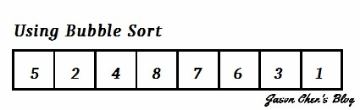

# Bubble Sort 氣泡排序法

- 簡介
    - 氣泡排序法重複地走訪過要排序的數列，一次比較兩個元素，如果他們的順序錯誤就把他們交換過來
    - 走訪數列的工作是重複地進行直到沒有再需要交換，也就是說**該數列已經排序完成**
    - 執行時，未排序資料中的最大值會如同氣泡般往右浮，氣泡排序法因而得名
- 作法
    1. 將資料分為
        - **已排序**：位置 < data.length - i - 1
        - **未排序**：位置 ≥ data.length - i - 1
    2. 由**未排序**中的**第一筆**開始，與**第二筆**資料比對
        - 若**第一筆** > **第二筆** ⇒ **交換位置(Swap)**
        - 若還有**未排序**的資料，則用**第二筆**和**第三筆**資料比對。依此類推
    3. 若**未排序**的資料中，比對時都沒有進行**交換位置** ⇒ **flag = false**
        - 代表資料已排序好 ⇒ 提早結束排序

- 時間複雜度(Time Complexity)
    - Best Case: 
    - Worst Case: 
    - Average Case: 
- 空間複雜度(Space Complexity)：
- 穩定性(Stable/Unstable)：穩定(Stable)
