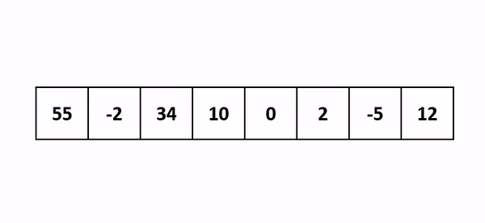

# Insertion Sort 插入排序法

- 簡介
    - 插入排序將一筆資料插入到已經排序好的有序數列中，從而得到新的、資料筆數加一的有序數列
- 作法
    1. 將資料分成**已排序**、**未排序**兩部份
    2. 依序由**未排序**中的**第一筆**(正處理的值)，插入到**已排序**中的適當位置
        - 插入時**由右而左**比較，直到遇到第一個比**正處理的值**小的值，再插入
        - 比較時，若遇到的值比**正處理的值**大或相等，則將值往右移
- 時間複雜度(Time Complexity)
    - Best Case: 
    - Worst Case: 
    - Average Case: 
- 空間複雜度(Space Complexity)：
- 穩定性(Stable/Unstable)：穩定(Stable)
